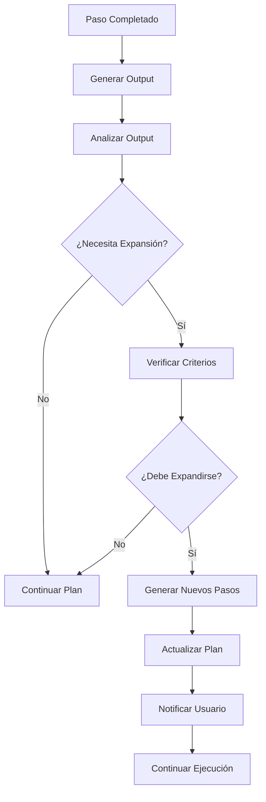

# 🔄 Sistema de Expansión Dinámica de Planes - Synapse MVP

## 📋 Descripción General

El Sistema de Expansión Dinámica permite que Synapse adapte automáticamente los planes de ejecución basándose en los resultados de cada paso. Cuando un paso genera outputs que indican problemas, necesidades adicionales o oportunidades de mejora, el sistema puede expandir el plan añadiendo nuevos pasos de forma inteligente.

## 🎯 Características Principales

### ✅ **Análisis Inteligente de Resultados**
- Análisis automático de outputs de cada paso
- Detección de patrones que indican necesidad de expansión
- Clasificación por prioridad (alta, media, baja)
- Cálculo de confianza basado en la severidad

### 🔄 **Expansión Automática**
- Generación dinámica de nuevos pasos
- Integración seamless con el plan existente
- Notificaciones en tiempo real al usuario
- Límites de seguridad para evitar expansiones excesivas

### 📊 **Criterios de Filtrado**
- Confianza mínima del 60%
- Máximo 5 pasos dinámicos por plan
- Probabilidades diferenciadas por prioridad
- Prioridad alta siempre se expande

## 🛠️ Arquitectura del Sistema

### **Componentes Principales**

#### 1. **dynamic_analysis.py** - Módulo de Análisis
```python
- analyze_step_results()    # Analiza outputs para detectar necesidades
- generate_dynamic_steps()  # Genera nuevos pasos basados en análisis
- should_expand_plan()      # Determina si aplicar la expansión
- notify_plan_expansion()   # Notifica sobre expansiones
```

#### 2. **synapse_server_final.py** - Integración Principal
- Integración en el bucle de ejecución de planes
- Llamadas automáticas después de cada paso completado
- Manejo de eventos WebSocket para notificaciones
- Actualización del plan en tiempo real

#### 3. **output_generators.py** - Generación de Triggers
- Outputs mejorados con 30% probabilidad de triggers
- Patrones realistas que activan análisis dinámico
- Variedad de escenarios (errores, optimizaciones, mejoras)

#### 4. **Frontend React** - Interfaz de Usuario
- Eventos WebSocket para expansiones (`plan_expansion_notification`, `plan_updated`)
- Notificaciones visuales de expansiones
- Actualización automática del plan en la UI

## 🔍 Patrones de Detección

### **Alta Prioridad** (Confianza: 85-95%)
```
❌.*ERROR.*ENCONTRADO
⚠️.*PROBLEMAS DETECTADOS
❌.*FALLÓ
ERROR.*CRÍTICO
FALLO.*SISTEMA
```

### **Media Prioridad** (Confianza: 70-85%)
```
⚠️.*CONFIGURACIÓN ADICIONAL REQUERIDA
🔍.*ANÁLISIS INCOMPLETO
⚠️.*COBERTURA INSUFICIENTE
🔧.*OPTIMIZACIÓN REQUERIDA
🔍.*TESTING ADICIONAL REQUERIDO
```

### **Baja Prioridad** (Confianza: 60-75%)
```
💡.*MEJORAS SUGERIDAS
💡.*RECOMENDACIONES
🔍.*MONITOREO RECOMENDADO
💡.*PRÓXIMOS PASOS
💡.*CONSIDERAR IMPLEMENTAR
```

## 📈 Flujo de Ejecución



## 🎮 Ejemplos de Uso

### **Ejemplo 1: Error en API Externa**
```
Input: "⚠️ PROBLEMAS DETECTADOS: Error en la integración con API externa"
Análisis: Alta prioridad, 94% confianza
Pasos Generados:
- Configurar integración con API externa
- Validar conexión con API
```

### **Ejemplo 2: Optimización de Rendimiento**
```
Input: "🔧 OPTIMIZACIÓN REQUERIDA: Rendimiento subóptimo en consultas"
Análisis: Media prioridad, 78% confianza
Pasos Generados:
- Optimizar consultas de base de datos
- Implementar cache de consultas
```

### **Ejemplo 3: Mejoras Sugeridas**
```
Input: "💡 MEJORAS SUGERIDAS: Considerar implementar sistema de logs"
Análisis: Baja prioridad, 65% confianza
Pasos Generados:
- Implementar sistema de logging avanzado
```

## 🔧 Configuración y Parámetros

### **Parámetros de Análisis**
```python
MIN_CONFIDENCE = 0.6        # Confianza mínima para expansión
MAX_DYNAMIC_STEPS = 5       # Máximo pasos dinámicos por plan
TRIGGER_PROBABILITY = 0.3   # Probabilidad de generar triggers

# Probabilidades por prioridad
HIGH_PRIORITY_PROB = 1.0    # 100% - Siempre se expande
MEDIUM_PRIORITY_PROB = 0.7  # 70% - Probabilidad de expansión
LOW_PRIORITY_PROB = 0.4     # 40% - Probabilidad de expansión
```

### **Eventos WebSocket**
```javascript
// Notificación de expansión
socket.on('plan_expansion_notification', (data) => {
    // data.expansion_reason
    // data.new_steps_count
    // data.confidence
});

// Plan actualizado
socket.on('plan_updated', (data) => {
    // data.plan - Plan completo actualizado
    // data.new_steps_added - Número de pasos añadidos
    // data.expansion_reason - Razón de la expansión
});
```

## 🧪 Testing y Validación

### **Script de Prueba**
```bash
python test_dynamic_expansion.py
```

### **Tests Incluidos**
1. **Test de Análisis**: Verifica detección de patrones
2. **Test de Generación**: Valida creación de pasos dinámicos
3. **Test de Criterios**: Confirma filtros de expansión
4. **Test de Outputs**: Verifica generación de triggers
5. **Test de Notificación**: Valida sistema de notificaciones

### **Resultados Esperados**
```
✅ Test funciones dinámicas: PASÓ
✅ Test generación outputs: PASÓ
🎉 TODOS LOS TESTS PASARON - Sistema listo para uso
```

## 📊 Métricas y Monitoreo

### **Métricas Clave**
- **Tasa de Expansión**: % de planes que se expanden
- **Precisión de Análisis**: % de expansiones útiles
- **Tiempo de Análisis**: Latencia del análisis dinámico
- **Satisfacción del Usuario**: Feedback sobre expansiones

### **Logs de Sistema**
```
🔍 Analizando resultados del paso 2 para posible expansión...
🔄 Expansión sugerida: Errores críticos detectados
✅ Expandiendo plan dinámicamente...
🎯 Plan expandido: 2 pasos añadidos
```

## 🚀 Beneficios del Sistema

### **Para el Usuario**
- **Adaptabilidad**: Planes que se ajustan automáticamente
- **Completitud**: No se pierden pasos importantes
- **Transparencia**: Notificaciones claras sobre cambios
- **Eficiencia**: Menos intervención manual requerida

### **Para el Sistema**
- **Inteligencia**: Aprendizaje de patrones comunes
- **Robustez**: Manejo automático de situaciones imprevistas
- **Escalabilidad**: Sistema modular y extensible
- **Calidad**: Mejora continua de la ejecución

## 🔮 Futuras Mejoras

### **Versión 2.0**
- **Machine Learning**: Modelos predictivos para análisis
- **Personalización**: Patrones específicos por usuario
- **Integración**: Conexión con herramientas externas
- **Analytics**: Dashboard de métricas avanzadas

### **Características Avanzadas**
- **Análisis Semántico**: NLP para mejor comprensión
- **Expansión Condicional**: Reglas complejas de expansión
- **Rollback Inteligente**: Deshacer expansiones problemáticas
- **Optimización Automática**: Mejora continua de patrones

---

## 📝 Notas de Implementación

- **Compatibilidad**: Compatible con todos los planes existentes
- **Rendimiento**: Análisis optimizado para baja latencia
- **Seguridad**: Límites estrictos para prevenir bucles infinitos
- **Mantenibilidad**: Código modular y bien documentado

**Estado**: ✅ **IMPLEMENTADO Y FUNCIONAL**
**Versión**: 1.0.0
**Fecha**: 2025-06-13