# Diagrama de Flujo de Synapse

## Arquitectura General

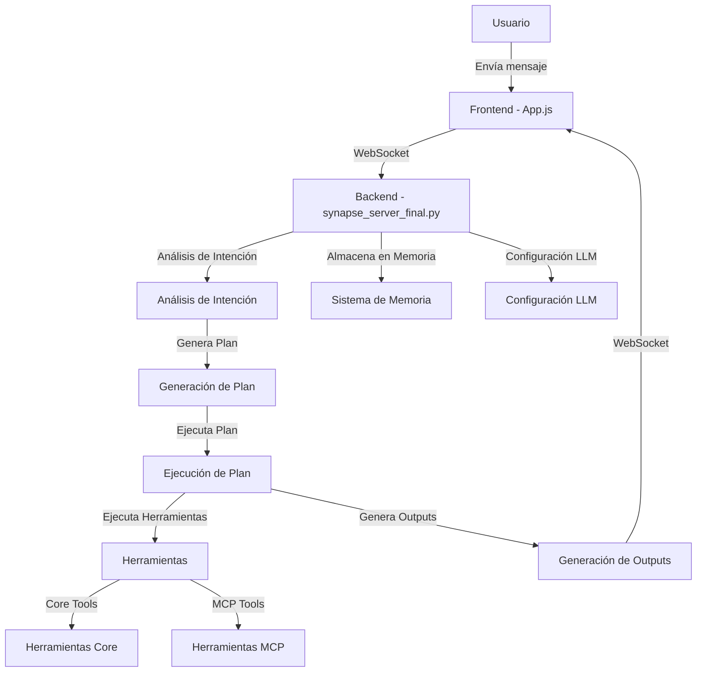

## Flujo Detallado

### 1. Entrada del Usuario y Procesamiento Inicial

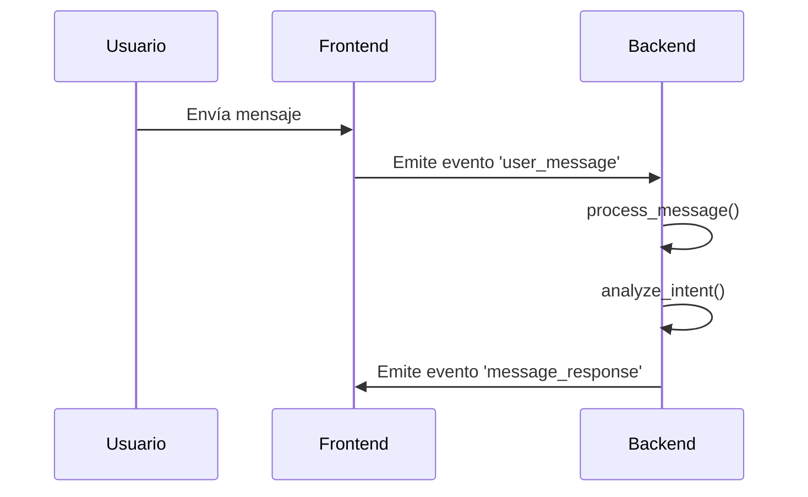

**Archivos Relevantes:**
- Frontend: [synapse-ui-new/src/App.js](synapse-ui-new/src/App.js)
- Backend: [synapse_server_final.py](synapse_server_final.py)
- Análisis de Intención: Función `analyze_intent()` en [synapse_server_final.py](synapse_server_final.py)

### 2. Generación y Ejecución del Plan

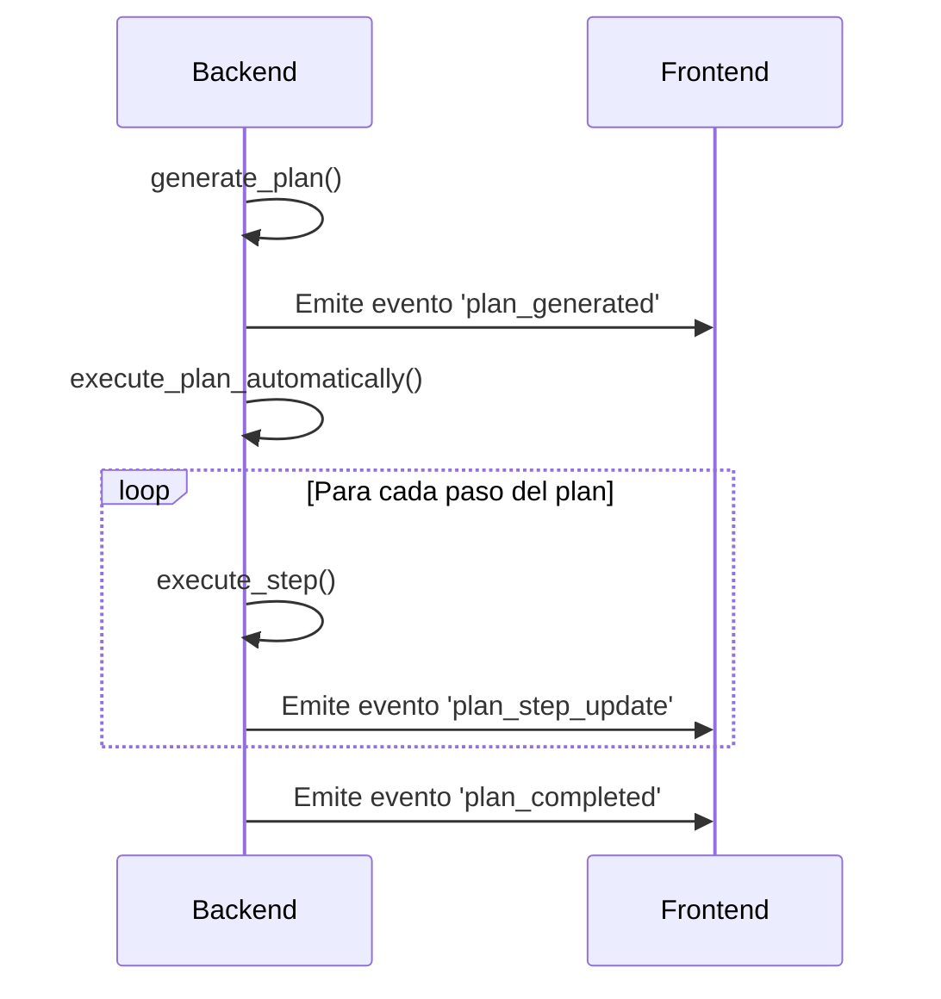

**Archivos Relevantes:**
- Generación de Plan: Función `generate_plan()` en [synapse_server_final.py](synapse_server_final.py)
- Ejecución de Plan: Función `execute_plan_automatically()` en [synapse_server_final.py](synapse_server_final.py)
- Ejecución de Pasos: Función `execute_step()` en [synapse_server_final.py](synapse_server_final.py)

### 3. Ejecución de Herramientas

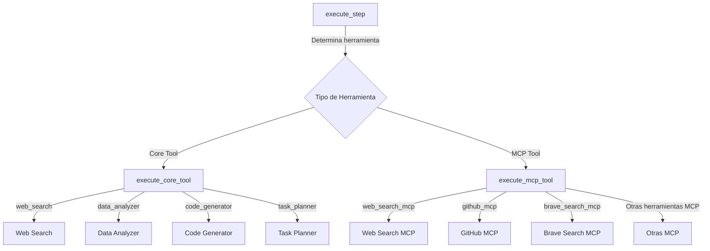

**Archivos Relevantes:**
- Ejecución de Herramientas Core: Función `execute_core_tool()` en [synapse_server_final.py](synapse_server_final.py)
- Ejecución de Herramientas MCP: Función `execute_mcp_tool()` en [synapse_server_final.py](synapse_server_final.py)
- Implementación de Herramientas MCP Reales: [mcp_integration/real_mcp_tools.py](mcp_integration/real_mcp_tools.py)

### 4. Análisis Dinámico y Expansión del Plan

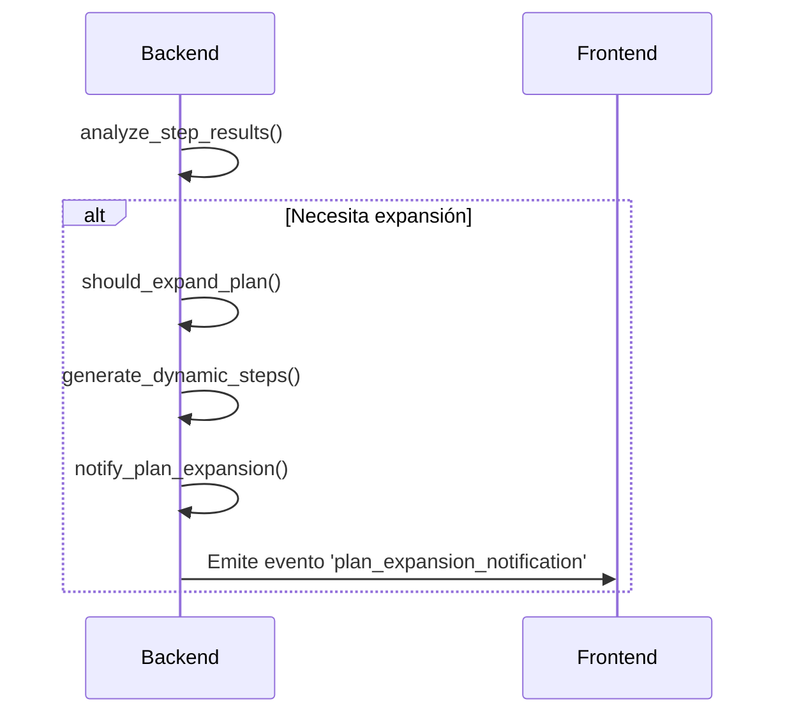

**Archivos Relevantes:**
- Análisis Dinámico: [dynamic_analysis.py](dynamic_analysis.py)
- Generación de Outputs: [output_generators.py](output_generators.py)

### 5. Sistema de Memoria

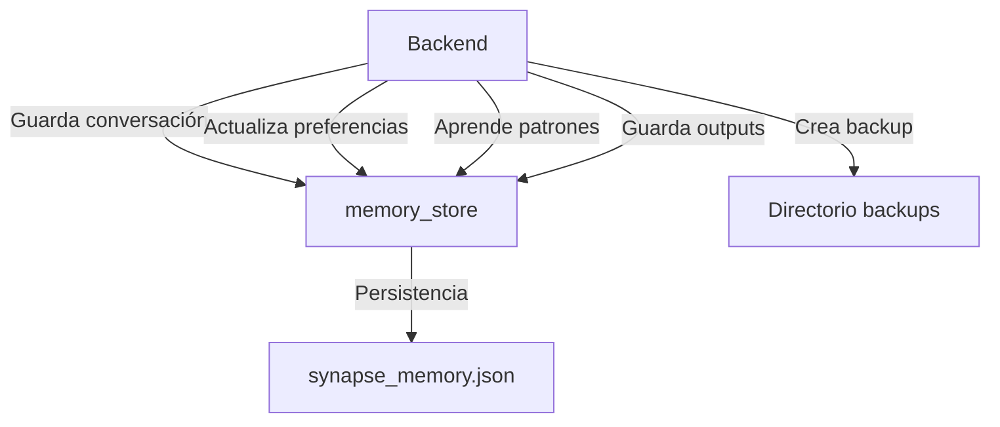

**Archivos Relevantes:**
- Sistema de Memoria: Funciones de memoria en [synapse_server_final.py](synapse_server_final.py)
- Análisis de Memoria: [ANALISIS_MEMORIA_SYNAPSE.md](ANALISIS_MEMORIA_SYNAPSE.md)
- Memoria Mejorada: [MEMORIA_MEJORADA_SYNAPSE.md](MEMORIA_MEJORADA_SYNAPSE.md)

### 6. Configuración de LLMs

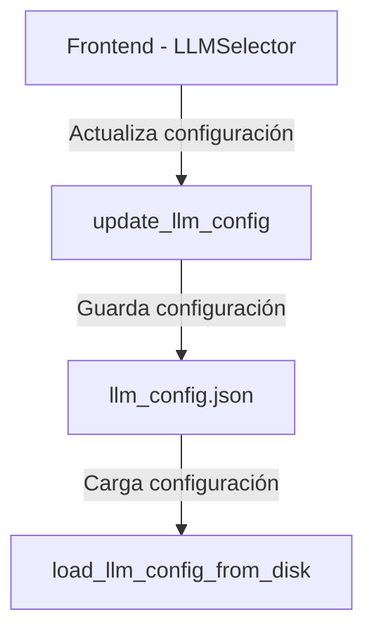

**Archivos Relevantes:**
- Configuración LLM: [llm_config.json](llm_config.json)
- Selector de LLM: [synapse-ui-new/src/components/LLMSelector.js](synapse-ui-new/src/components/LLMSelector.js)
- Documentación: [CONFIGURACION_LLMS_SYNAPSE.md](CONFIGURACION_LLMS_SYNAPSE.md)

## Flujo de Datos Completo

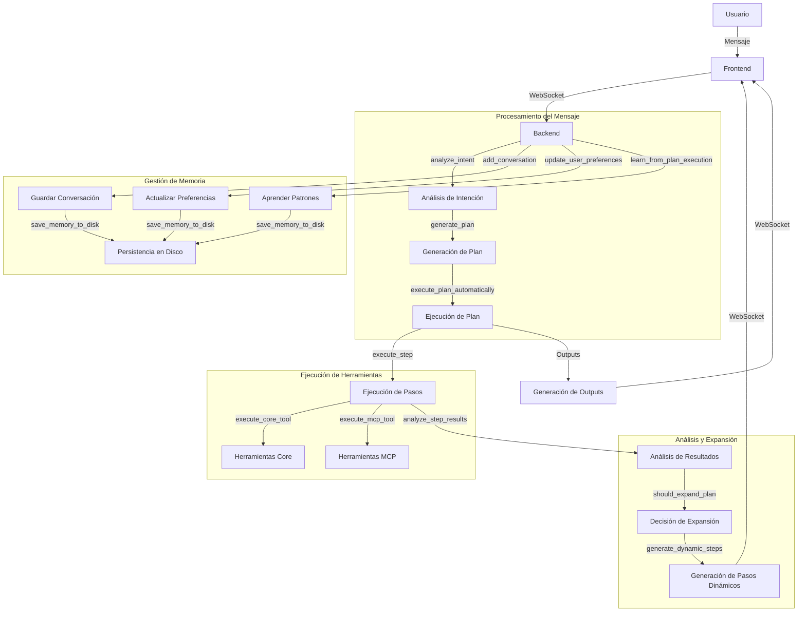

## Detalles de Implementación de Herramientas

### Herramientas Core

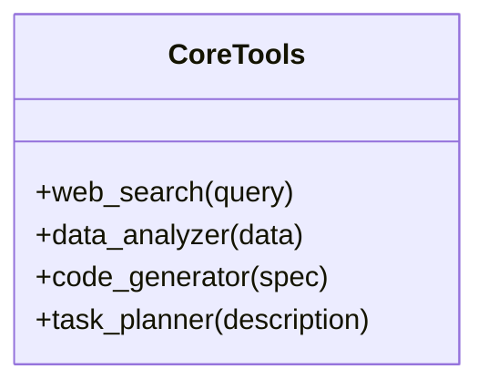

**Implementación:** [synapse_server_final.py](synapse_server_final.py) - Función `execute_core_tool()`

### Herramientas MCP

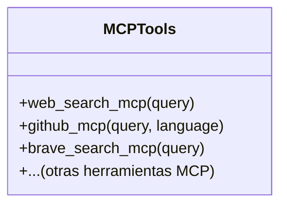

**Implementación:** 
- [mcp_integration/real_mcp_tools.py](mcp_integration/real_mcp_tools.py) - Función `execute_real_mcp_tool()`
- Documentación: [CORRECCION_MCP_REALES_FINAL.md](CORRECCION_MCP_REALES_FINAL.md)

## Arquitectura de Componentes

```mermaid
componentDiagram
    component Frontend {
        [App.js]
        [ConversationPanel]
        [PlanningPanel]
        [ToolsPanel]
        [OutputsPanel]
        [MemoryPanel]
        [LLMSelector]
    }
    
    component Backend {
        [synapse_server_final.py]
        [Análisis de Intención]
        [Generación de Plan]
        [Ejecución de Plan]
        [Sistema de Memoria]
        [Configuración LLM]
    }
    
    component Herramientas {
        [Core Tools]
        [MCP Tools]
        [real_mcp_tools.py]
    }
    
    component Análisis {
        [dynamic_analysis.py]
        [output_generators.py]
    }
    
    Frontend --> Backend : WebSocket
    Backend --> Herramientas : Llamadas
    Backend --> Análisis : Llamadas
```

## Arquitectura de la Aplicación

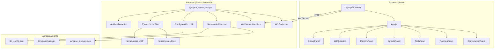

## Comunicación WebSocket

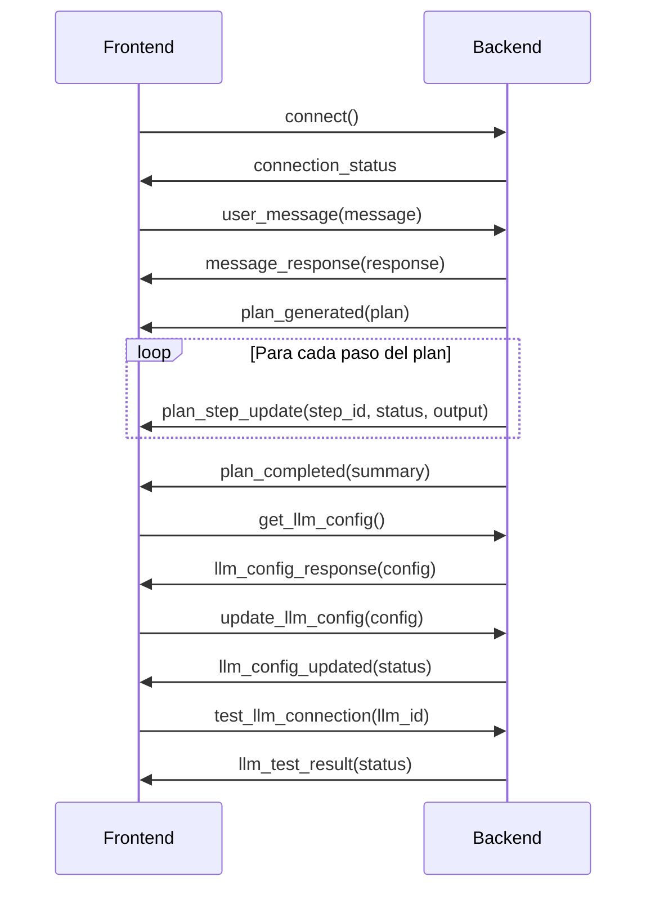

## API REST Endpoints

| Endpoint | Método | Descripción | Implementación |
|----------|---------|-------------|----------------|
| `/api/health` | GET | Estado del servidor | `synapse_server_final.py` |
| `/api/tools` | GET | Lista de herramientas disponibles | `synapse_server_final.py` |
| `/api/memory/all` | GET | Obtener toda la memoria | `synapse_server_final.py` |
| `/api/memory/stats` | GET | Estadísticas de memoria | `synapse_server_final.py` |
| `/api/memory/backup` | POST | Crear backup de memoria | `synapse_server_final.py` |
| `/api/memory/clear` | POST | Limpiar memoria | `synapse_server_final.py` |
| `/api/config` | GET | Obtener configuración | `synapse_server_final.py` |
| `/api/config/llm` | POST | Actualizar configuración LLM | `synapse_server_final.py` |
| `/api/outputs/recent` | GET | Obtener outputs recientes | `synapse_server_final.py` |
| `/api/mcp/tools/:tool_id/execute` | POST | Ejecutar herramienta MCP | `synapse_server_final.py` |

## Despliegue con Docker

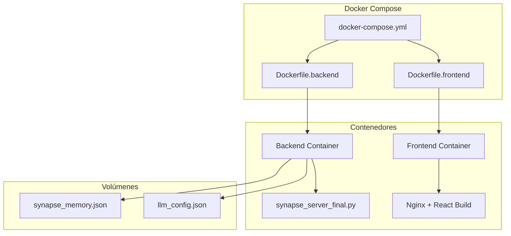

## Conclusión

Este diagrama de flujo completo muestra la arquitectura y funcionamiento de Synapse, un sistema de agente autónomo que procesa mensajes del usuario, genera planes, ejecuta herramientas, y proporciona resultados detallados. El sistema está compuesto por:

1. **Frontend React**: Interfaz de usuario con paneles especializados para conversación, planificación, herramientas, outputs y memoria.

2. **Backend Flask+SocketIO**: Servidor que maneja la lógica principal, incluyendo análisis de intención, generación de planes, ejecución de herramientas, y gestión de memoria.

3. **Herramientas**: Conjunto de herramientas core (web_search, data_analyzer, code_generator, task_planner) y herramientas MCP (web_search_mcp, github_mcp, brave_search_mcp) que proporcionan funcionalidades especializadas.

4. **Sistema de Memoria**: Almacena conversaciones, preferencias de usuario, patrones aprendidos, y outputs de planes, con persistencia en disco.

5. **Configuración de LLMs**: Permite seleccionar diferentes modelos de lenguaje para cada agente interno (conversación, planificación, ejecución, análisis, memoria, optimización).

6. **Análisis Dinámico**: Analiza los resultados de los pasos y expande los planes dinámicamente según sea necesario.

El sistema utiliza WebSockets para comunicación en tiempo real entre el frontend y el backend, y ofrece una API REST para acceder a diversas funcionalidades. Se despliega utilizando Docker Compose, con contenedores separados para el frontend y el backend.

## Proceso de Ejecución de Herramientas MCP

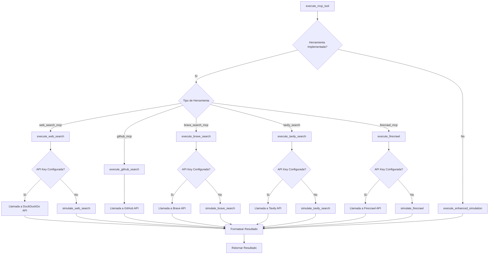

### Implementación de Herramientas MCP Reales

La implementación de las herramientas MCP reales se encuentra en el archivo `mcp_integration/real_mcp_tools.py`. Cada herramienta tiene su propia función de ejecución que maneja la llamada a la API correspondiente y el procesamiento de los resultados.

#### Ejemplo: Implementación de Web Search MCP

```python
def execute_web_search(parameters):
    """Ejecuta búsqueda web usando DuckDuckGo API"""
    query = parameters.get('query', parameters.get('q', 'synapse ai assistant'))

    try:
        # URL de la API de DuckDuckGo
        url = "https://api.duckduckgo.com/"
        params = {
            'q': query,
            'format': 'json',
            'no_html': '1',
            'skip_disambig': '1'
        }

        # Realizar la solicitud
        response = requests.get(url, params=params, timeout=10)
        data = response.json()

        # Formatear resultado
        result_text = f"Resultados de búsqueda para: '{query}'\n\n"

        if data.get('Abstract'):
            result_text += f"Resumen: {data['Abstract']}\n\n"

        if data.get('Definition'):
            result_text += f"Definición: {data['Definition']}\n\n"

        if data.get('RelatedTopics'):
            result_text += "Temas relacionados:\n"
            for i, topic in enumerate(data['RelatedTopics'][:5], 1):
                if 'Text' in topic:
                    result_text += f"{i}. {topic['Text']}\n"

        # Construir resultado
        return {
            'success': True,
            'tool_id': 'web_search_mcp',
            'result': result_text,
            'raw_data': data,
            'execution_time': round(time.time() - start_time, 2),
            'timestamp': datetime.now().isoformat()
        }

    except Exception as e:
        return {
            'success': False,
            'tool_id': 'web_search_mcp',
            'error': f'Error en búsqueda web: {str(e)}',
            'execution_time': round(time.time() - start_time, 2),
            'timestamp': datetime.now().isoformat()
        }
```

### Integración con el Sistema Principal

Las herramientas MCP se integran con el sistema principal a través de la función `execute_step` en `synapse_server_final.py`, que determina qué herramienta debe ejecutarse para cada paso del plan y llama a la función correspondiente.

```python
def execute_step(step, plan):
    """Ejecuta un paso del plan"""
    # ... código omitido ...

    # Ejecutar herramientas asignadas al paso
    tool_results = []
    if 'tools' in step and step['tools']:
        for tool_id in step['tools']:
            # Obtener parámetros para la herramienta
            tool_params = step.get('tool_parameters', {}).get(tool_id, {})

            # Ejecutar herramienta MCP
            if tool_id in [t['id'] for t in available_tools if t['type'] == 'mcp']:
                tool_result = execute_mcp_tool(tool_id, tool_params)
                tool_results.append(tool_result)

            # Ejecutar herramientas core
            elif tool_id in [t['id'] for t in available_tools if t['type'] == 'core']:
                core_result = execute_core_tool(tool_id, tool_params, step)
                tool_results.append(core_result)

    # ... código omitido ...
```